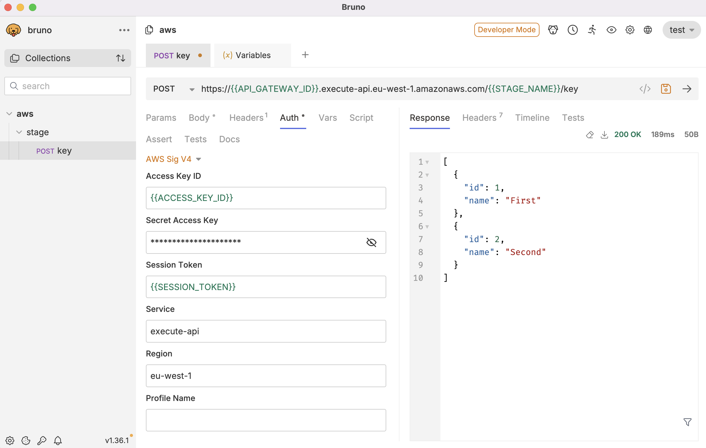

# playground-axios-aws-v4-signature

A demo app that uses AWS Signature V4 for Auth

There are three parts to this project:

- /app - the HTTP lambda that gets deployed by terraform
- /infrastructure - the infrastructure which (also deploys the /app lambda)
- /acceptance-tests - the tests that exercise the AWS Signature V4 code

## Instructions

Install any missing NPM packages:

```bash
npm ci
```

Deploy the lambda and get the API Gateway URL. For var.iam_user_arn use a role you've created and been added to:

```bash
cd infrastructure

awsume <your_role_here>

terraform init

terraform apply --var environment=test --var iam_user_arn=<your_role_here>
```

Take the `domain_name` value and shove it into the first part of the domain in [acceptance-tests/endpoint.test.ts](acceptance-tests/endpoint.test.ts)

```typescript
const sut = new ExampleClient({
  baseUrl: "PUT_YOUR_DOMAIN_HERE",
  accessKeyId: config.AWS_ACCESS_KEY_ID,
  region: "eu-west-1",
  secretAccessKey: config.AWS_SECRET_ACCESS_KEY,
  sessionToken: config.AWS_SESSION_TOKEN,
});
```

## Axios Interceptors

The AWS Signature v4 is calculated based off the values in the header and body. An interceptor can calculate this before the request is sent. Axios supports interceptor and there is a NPM package that can do this for you.

https://www.npmjs.com/package/aws4-axios

```typescript
// create a separate Axios Instance rather than affect the global Axios instance
const axiosInstance: AxiosInstance = axios.create({
  baseURL: options.baseUrl,
});

// create a aws4Interceptor interceptor
const interceptor = aws4Interceptor({
  options: {
    region: options.region,
    service: "execute-api",
  },
  credentials: {
    accessKeyId: options.accessKeyId,
    secretAccessKey: options.secretAccessKey,
    sessionToken: options.sessionToken,
  },
});

// add the aws4Interceptor interceptor to the request pipeline (outgoing)
axiosInstance.interceptors.request.use(interceptor);

// make your call - this will succeed and go via the interceptor
const result = await this.axiosInstance({
  url: "/v1/users",
  method: "POST",
  data,
});
```

## Bruno

There is an example [Bruno](https://www.usebruno.com/) collection in this project at ./bruno with an example AWS Sig V4 setup.

Add the collection to your Bruno client to use it. Remember to never save anything sensitive and to use Environment variables and secrets.


